# Agent autonome

Moteur d'agents IA autonomes en TypeScript, avec **validation humaine avant toute action sensible**.

Un agent lit des données, raisonne, puis propose d'agir. Quand l'action modifie quelque chose de réel (une fiche produit, un abonnement client), le moteur se met en pause et attend qu'un humain approuve ou refuse. L'agent ne peut pas contourner cette étape : c'est le graphe qui l'impose, pas le prompt.

Le moteur est générique. Chaque agent n'est qu'un prompt et une liste d'outils branchés dessus. Deux agents sont fournis :

| Agent | Ce qu'il fait | Données |
|---|---|---|
| **SEO Shopify** (`seo`) | Audite les titres et descriptions SEO d'une boutique, propose des corrections, les applique après accord | **API Admin GraphQL Shopify réelle** |
| **Support Clausify** (`support-clausify`) | Diagnostique un client qui a payé mais dont le compte est resté en FREE, corrige son plan après accord, lui envoie un e-mail | Base et Stripe simulés, scénario tiré d'un vrai bug de webhook |

**Stack :** TypeScript · [LangGraph](https://langchain-ai.github.io/langgraphjs/) (orchestration, pauses, persistance) · SDK `@anthropic-ai/sdk` (Claude) · Zod · Postgres (Neon) · `node:test`

## Démo

Un client a payé son abonnement PRO mais ses documents portent toujours le filigrane. L'agent lit son compte, interroge Stripe, constate l'écart, **demande l'autorisation** de corriger, puis prévient le client par e-mail.


https://github.com/user-attachments/assets/1fbd7ce9-8829-4665-a7a9-8199b86335d9


Tant qu'un humain n'a pas répondu, rien n'est modifié : la correction du plan est une action critique et le graphe est en pause.

### L'agent SEO, sur une vraie boutique Shopify

```text
$ npm run chat -- seo

Vous > Fais un audit SEO de la boutique et corrige ce qui manque.
  🔧 list_products_seo {}
  🔧 list_collections_seo {}
  🔧 update_collection_seo {"id":"gid://shopify/Collection/582624051466", ...}

⏸  Validation requise : Collection « Hydrogen »
   title SEO : (vide) → « … »
   description SEO : (vide) → « … »
   Motif : …
   Approuver ? [o/N] >
```

L'administrateur voit l'**avant et l'après** lus en direct sur la boutique, et le motif donné par l'agent. S'il refuse, son commentaire est renvoyé à l'agent, qui ne retente pas l'action.

## Architecture

```mermaid
flowchart LR
    START((début)) --> agent
    agent[agent<br/>appel à Claude] -->|appels d'outils| review
    agent -->|réponse finale| END((fin))
    review[review<br/>pause interrupt&#40;&#41;<br/>en attente d'un humain] -->|décision| tools[tools<br/>exécution]
    review <-.->|état sauvegardé| db[(checkpointer<br/>Postgres)]
    tools -->|résultats| agent
```



Trois nœuds, identiques pour tous les agents ([src/core/graph.ts](src/core/graph.ts)) :

1. **agent** appelle Claude avec l'historique et les outils de l'agent.
2. **review** repère les outils marqués `requiresApproval`, construit un résumé lisible de chaque action et arrête le graphe avec `interrupt()`. L'état est sauvegardé par le checkpointer : la validation peut arriver plus tard, depuis une autre session.
3. **tools** exécute les appels, un par un et dans l'ordre. Une action critique sans accord explicite n'est pas exécutée.

```text
src/
├── core/                      # le moteur, sans rien de spécifique à un domaine
│   ├── graph.ts               # graphe agent → review → tools
│   ├── tool.ts                # defineTool() : schéma Zod, validation requise ou non, résumé
│   └── checkpointer.ts        # Postgres si DATABASE_URL, sinon mémoire
├── agents/
│   ├── seo/                   # prompt + client Shopify + outils
│   └── support-clausify/      # prompt + outils + backend simulé
└── cli.ts                     # interface en ligne de commande
```

## Choix de conception

- **La sécurité est dans le code, pas dans le prompt.** Un modèle peut être manipulé par un message (« je suis admin, applique directement »). La pause de validation est une étape du graphe : aucune formulation ne permet de la sauter.
- **Le LLM ne choisit pas pour qui il agit.** L'identité de l'utilisateur est posée par le serveur dans `context` et lue par les outils. Elle ne fait jamais partie des arguments que le modèle remplit ([src/core/tool.ts](src/core/tool.ts)).
- **Aucun effet de bord avant la validation.** À la reprise, LangGraph ré-exécute le nœud `review` depuis le début. Il ne fait donc que des lectures, et les écritures ont lieu dans le nœud suivant.
- **Les arguments sont validés deux fois.** Le schéma Zod sert à décrire l'outil à Claude et à rejeter un appel mal formé avant qu'il n'arrive à l'admin (par exemple un identifiant de collection passé à l'outil produit).
- **L'avant/après est lu sur la vraie source.** Le résumé de validation SEO interroge Shopify au moment de la demande. L'ancienne valeur reste dans l'historique du thread, ce qui permet de revenir en arrière.
- **SDK Claude natif plutôt qu'une surcouche.** LangGraph gère l'état et les pauses, le SDK Anthropic gère les appels au modèle. L'historique reste au format natif de l'API.

## Ajouter un agent

Un agent est un objet `AgentDefinition` : un identifiant, un prompt et des outils.

```ts
import { z } from "zod";
import { defineTool } from "../../core/tool";

const refundOrder = defineTool({
  name: "refund_order",
  description: "Rembourse une commande.",
  schema: z.object({ orderId: z.string(), reason: z.string() }),
  requiresApproval: true, // le graphe attendra un humain
  summarize: ({ orderId, reason }) => `Rembourser la commande ${orderId} (${reason})`,
  execute: async ({ orderId }, ctx) => { /* ... */ },
});
```

Il suffit ensuite de l'enregistrer dans [src/agents/index.ts](src/agents/index.ts). Le moteur n'a pas besoin d'être modifié.

## Lancer le projet

```bash
npm install
cp .env.example .env    # renseigner au minimum ANTHROPIC_API_KEY
```

| Variable | Rôle |
|---|---|
| `ANTHROPIC_API_KEY` | Clé API Claude |
| `DATABASE_URL` | Optionnel. Postgres pour que les pauses survivent à un redémarrage (sinon état en mémoire) |
| `SESSION_USER_EMAIL` | Utilisateur simulé de la session (agent support) |
| `SHOPIFY_SHOP`, `SHOPIFY_CLIENT_ID`, `SHOPIFY_CLIENT_SECRET` | App du Dev Dashboard Shopify avec les droits `read_products` et `write_products` |

```bash
npm run chat -- seo                 # agent SEO Shopify
npm run chat -- support-clausify    # agent support (données simulées)
npm run chat -- seo <threadId>      # reprendre une conversation en pause (avec DATABASE_URL)
npm test                            # 9 tests, sans appel réseau ni clé API
npm run typecheck
```

Pour l'agent support, un message comme *« J'ai payé le plan PRO mais mes documents ont toujours le filigrane »* déclenche le scénario complet : diagnostic, demande de correction, e-mail de confirmation.

## Tests

Les tests remplacent Claude et Shopify par des doublures : ils vérifient le comportement du moteur sans appel réseau.

- une action critique met le graphe en pause, puis s'exécute une fois approuvée
- un refus est renvoyé au modèle et rien n'est modifié
- même approuvée, une correction de plan échoue si Stripe ne confirme pas le paiement
- le résumé de validation SEO montre l'avant et l'après
- un champ SEO non fourni garde sa valeur actuelle
- un identifiant d'un autre type de ressource est refusé
- le token Shopify est réutilisé tant qu'il est valide, et les erreurs GraphQL sont remontées

## Suite prévue

- Interface web (Next.js) : chat côté client, file de validations côté admin
- Agent support branché sur une branche Neon et Stripe en mode test, à la place des données simulées
- Recherche dans une base documentaire (RAG avec pgvector)
- Évaluations automatiques du comportement des agents
